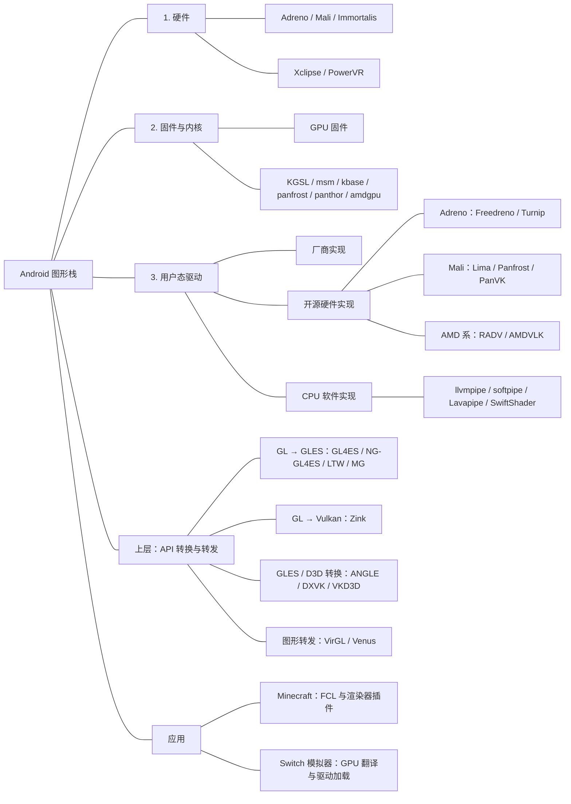

# android-graphics-stack

Android 图形软件栈：从 GPU 硬件、底层驱动到 Mesa、API 转换层，以及 Minecraft 启动器和 Switch 模拟器中的图形实现。

> 更新：2026-10-07。本文按硬件、驱动、转换层和应用整理 Android 图形实现。

具体设备适配涉及 GPU 型号、内核接口和应用加载方式。各条目后的项目链接提供支持表与发布说明。

## 结构总览

正文从硬件写到应用。树状图用于查找组件；应用实际调用时，方向通常是应用 → 转换层 → 用户态驱动 → 内核 → GPU。

**Mesa 横跨多个分支：**其中既有硬件驱动，也有 Zink、VirGL 和 CPU 软件实现。OpenGL、GLES、Vulkan 是这些组件对外提供或内部使用的 API，见第 4 节。

## 目录

1. [GPU 硬件](#1-gpu-硬件)
2. [固件与内核驱动](#2-固件与内核驱动)
3. [用户态驱动与 Mesa](#3-用户态驱动与-mesa)
4. [图形 API 与平台接口](#4-图形-api-与平台接口)
5. [API 转换与兼容层](#5-api-转换与兼容层)
6. [图形虚拟化与运行环境](#6-图形虚拟化与运行环境)
7. [Minecraft 启动器与 FCL 渲染器](#7-minecraft-启动器与-fcl-渲染器)
8. [Android Switch 模拟器与驱动包](#8-android-switch-模拟器与驱动包)
9. [调用路径与排查](#9-调用路径与排查)

## 1. GPU 硬件

GPU 执行着色器、纹理采样、光栅化等工作。手机中，GPU 通常集成在 SoC 内，与 CPU 等单元共享系统内存。下面按硬件家族介绍，驱动放在第 2、3 节。

### 1.1 Adreno

Qualcomm 的 GPU 家族，常见于 Snapdragon。Adreno 有自己的指令集和渲染架构，型号随芯片代际变化；同一代产品的规模、频率和功能也可能不同。

资料：[Qualcomm Snapdragon](https://www.qualcomm.com/snapdragon)。

### 1.2 Mali 与 Immortalis

Arm 授权给芯片厂商的 GPU IP，常见于联发科、瑞芯微等 SoC。Mali 先后采用 Utgard、Midgard、Bifrost、Valhall 等架构；Immortalis 是 Arm 的高端 GPU 产品系列。判断硬件能力需要具体型号与架构。

资料：[Arm GPU](https://www.arm.com/products/silicon-ip-multimedia/gpu)。

### 1.3 Xclipse

Samsung 与 AMD 合作的 GPU 系列，集成在部分 Exynos 中，采用 AMD RDNA 技术。例如，Exynos 2200 的 Xclipse 920 基于 RDNA 2，Exynos 2400 的 Xclipse 940 基于 RDNA 3。

它继承了 AMD 图形架构的技术基础，同时针对移动 SoC 的功耗、内存和平台作了调整。这也是社区研究 AMD 驱动移植的基础，具体驱动路线见第 3 节。

资料：[Exynos 2200](https://semiconductor.samsung.com/processor/mobile-processor/exynos-2200/)、[Exynos 2400](https://semiconductor.samsung.com/processor/mobile-processor/exynos-2400/)。

### 1.4 PowerVR

Imagination 的 GPU IP 家族，用于部分移动与嵌入式 SoC。其代表性设计是基于分块的延迟渲染：将画面划分为小块，尽量减少外部内存访问。不同 PowerVR 系列的功能和驱动支持差异较大。

资料：[Imagination GPU](https://www.imaginationtech.com/products/gpu/)。

## 2. 固件与内核驱动

### 2.1 GPU 固件

固件运行在 GPU 内部控制处理器等单元上，参与命令处理或调度。部分 GPU 即使采用开源驱动，仍需加载厂商固件。

固件随系统加载；模拟器导入的驱动 ZIP 则装载用户态图形库。

### 2.2 Adreno 内核驱动

| 项目 | 常见环境 | 职责 |
| --- | --- | --- |
| KGSL | Qualcomm Android 内核 | 为用户态驱动提供设备访问、内存与命令提交等接口 |
| msm DRM | 主线 Linux | 提供 Adreno 图形设备的 Linux DRM 接入 |

参考：[Mesa Freedreno/Turnip](https://docs.mesa3d.org/drivers/freedreno.html)。

### 2.3 Mali 内核驱动

| 项目 | 常见环境 | 适配范围 |
| --- | --- | --- |
| Mali kbase 等厂商接口 | Android 与厂商 Linux | 依设备所用厂商驱动栈而定 |
| panfrost DRM | 主线 Linux | 支持的 Mali 硬件，依内核版本而定 |
| panthor DRM | 主线 Linux | 采用 CSF 等架构机制的支持型号 |

**Panthor 是内核驱动，PanVK 是用户态 Vulkan 驱动。**名称接近，但层级不同。

参考：[Linux Panfrost](https://docs.kernel.org/gpu/panfrost.html)、[Linux Panthor](https://docs.kernel.org/gpu/panthor.html)。

### 2.4 Xclipse 内核接口

Samsung 的 Xclipse 内核图形栈包含 amdgpu 相关实现，并有设备侧适配。Android 移植驱动需要匹配手机实际提供的内存、命令提交与同步接口。

资料：[Samsung Xclipse 驱动安全公告](https://semiconductor.samsung.com/support/quality-support/product-security-updates/cve-2024-31960/)。

### 2.5 显示与缓冲区接口

GPU 将画面渲染到缓冲区，窗口系统和合成器接收、合成这些缓冲区，显示控制器负责输出到屏幕。Android 的分配器、mapper 和同步机制负责衔接这条路径。

## 3. 用户态驱动与 Mesa

用户态驱动接收图形 API 请求，编译着色器、管理资源并生成 GPU 命令，再通过内核接口提交。

### 3.1 Mesa 与 Gallium3D

**Mesa 是一组图形实现的集合。**它包含硬件驱动、软件渲染器、API 转换层、着色器编译器和平台适配代码。

**Gallium3D 是 Mesa 内部的驱动框架。**Freedreno、Panfrost、Zink、VirGL、llvmpipe 等复用其接口；Turnip 等 Vulkan 驱动有各自的 API 实现路径。

例如，在 Adreno 上可以使用 Freedreno 提供 OpenGL、Turnip 提供 Vulkan；缺少硬件加速时，可以使用 llvmpipe 在 CPU 上运行 OpenGL。

参考：[Mesa](https://docs.mesa3d.org/index.html)、[Gallium](https://docs.mesa3d.org/gallium/index.html)、[许可证](https://docs.mesa3d.org/license.html)。

### 3.2 厂商硬件驱动

#### 3.2.1 Qualcomm 驱动

Android 系统中的 Adreno GLES/Vulkan 实现通常以闭源二进制随固件提供。模拟器里的“Qualcomm 自定义驱动包”可能是提取并重新包装的用户态库。

这类包中的厂商驱动是闭源二进制，分发项目可能另外开放打包脚本和适配代码。

#### 3.2.2 Arm/Mali 驱动

Android 的 Mali GLES/Vulkan 通常由设备厂商集成。它与设备内核、缓冲区和显示接口配套；换用 Linux 开源实现需要额外的平台适配。

#### 3.2.3 Samsung/Xclipse 驱动

系统随固件提供 Samsung 的 GLES/Vulkan 实现。社区正在研究其 AMD 驱动技术基础，并开发 RADV 移植与原生驱动包装层。

三星 Vulkan 驱动与 AMDVLK/PAL 的具体代码关系仍待可靠资料补充。

### 3.3 开源硬件驱动

以下项目处于同一用户态驱动层，按目标 GPU 与 API 区分。

#### 3.3.1 Freedreno

Mesa 的 **Adreno OpenGL/OpenGL ES** 驱动；广义名称也指 Adreno 开源生态。典型 Linux 路径为 OpenGL → Freedreno → msm DRM → Adreno。

官方：[Freedreno](https://docs.mesa3d.org/drivers/freedreno.html)。

#### 3.3.2 Turnip

Mesa 的 **Adreno Vulkan** 驱动，与 Freedreno 共享部分底层组件，但分别实现不同 API。

Android 模拟器常用针对 KGSL 与应用加载机制编译的 Turnip 包。传统 OpenGL 应用通常需要 Zink 等上层实现与它组合。

官方：[Turnip 文档](https://docs.mesa3d.org/drivers/freedreno.html#turnip)。

#### 3.3.3 Lima

面向旧 **Mali Utgard**，如 Mali-400/450，主要提供 GLES 2.0 与一定桌面 GL 能力。

官方：[Lima](https://docs.mesa3d.org/drivers/lima.html)。

#### 3.3.4 Panfrost

Mesa 的 **Mali OpenGL/OpenGL ES** 驱动。它编译着色器、生成 Mali GPU 命令，并通过 panfrost 或 panthor 等内核驱动提交。

官方：[Panfrost](https://docs.mesa3d.org/drivers/panfrost.html)。

#### 3.3.5 PanVK

Panfrost 栈中的 **Mali Vulkan** 实现。Panfrost 提供 GL/GLES，PanVK 提供 Vulkan；两者共享部分 Mali 硬件支持代码。

官方：[PanVK](https://docs.mesa3d.org/drivers/panfrost.html)。

#### 3.3.6 RADV

Mesa 的 AMD Vulkan 驱动，与 Turnip、PanVK 同属硬件 Vulkan 实现，使用不同的硬件后端与编译器。

社区已有 Android Xclipse 移植。[radv-xclipse](https://github.com/JimVulkan/radv-xclipse) 当前 README 列出 Xclipse 920、530，并提供模拟器可加载的 ZIP 构建方式。

官方：[RADV](https://docs.mesa3d.org/drivers/radv.html)。

#### 3.3.7 AMDVLK

AMD 独立于 Mesa 的开源 Vulkan 实现，基于 PAL 等组件。其上游主要面向 Linux Radeon；上游仓库现已标记停止维护。将 AMDVLK 用于 Xclipse，需要适配 Android 与 Samsung 的设备接口。

官方：[AMDVLK](https://github.com/GPUOpen-Drivers/AMDVLK)。

### 3.4 CPU 软件实现

这些实现用 CPU 完成主要图形计算，是硬件渲染的替代路径。

| 项目 | 所属项目 | 主要 API/特点 |
| --- | --- | --- |
| llvmpipe | Mesa | OpenGL/GLES；LLVM JIT、多线程与向量化软件渲染 |
| softpipe | Mesa | OpenGL/GLES 软件实现，常用于参考与回退 |
| Lavapipe | Mesa | Vulkan 软件实现 |
| SwiftShader | Google 独立项目 | 以 CPU 为主的 Vulkan 实现 |

软件渲染适合测试、故障排查与轻量场景。CPU 需要承担原本由 GPU 并行执行的工作，复杂游戏中的性能通常较低。

参考：[llvmpipe](https://docs.mesa3d.org/drivers/llvmpipe.html)、[Mesa 源码](https://gitlab.freedesktop.org/mesa/mesa)、[SwiftShader](https://github.com/google/swiftshader)。

## 4. 图形 API 与平台接口

### 4.1 图形 API

| API | 定位 | 与 Android 适配的关系 |
| --- | --- | --- |
| OpenGL | 桌面图形接口 | Minecraft Java 的传统绘制路线；常需兼容层 |
| OpenGL ES（GLES） | 移动/嵌入式图形接口 | Android 原生图形的重要基础 |
| Vulkan | 显式图形与计算接口 | Turnip、Zink 和许多模拟器使用的宿主接口 |
| Direct3D | Windows 图形接口 | Android Windows 兼容环境常借助转换层 |

GLES 针对移动设备精简和调整了 OpenGL 的功能。桌面程序用到的部分接口，需要转换层模拟。Vulkan 则由应用更直接地管理资源、同步和命令提交。

参考：[Khronos OpenGL](https://www.khronos.org/opengl/)、[OpenGL ES](https://www.khronos.org/opengles/)、[Vulkan](https://www.vulkan.org/)、[Android Vulkan 指南](https://developer.android.com/ndk/guides/graphics)。

### 4.2 上下文、加载与呈现接口

| 名称 | 职责 |
| --- | --- |
| EGL | 建立图形上下文并连接平台表面 |
| GLX | 连接 OpenGL 与 X Window |
| OSMesa | OpenGL 离屏渲染接口，可接硬件或软件后端 |
| Vulkan Loader | 加载图形实现并分发调用 |
| WSI | Vulkan 与窗口、交换链和呈现系统的集成 |

### 4.3 着色器与中间表示

- **GLSL：**OpenGL/GLES 常用的着色器语言。
- **SPIR-V：**Vulkan 常见的着色器中间表示，由驱动继续编译成 GPU 指令。
- **NIR：**Mesa 内部用于优化和转换的中间表示。
- **GPU 机器码：**硬件驱动最终为特定 GPU 生成的指令。

首次进入场景卡顿可能来自着色器或管线编译；这与持续绘制性能不足应分开判断。

## 5. API 转换与兼容层

转换层处理应用 API 与平台 API 的差异，再交给下层驱动执行。**转换方向**是区分这些项目的关键。

### 5.1 桌面 OpenGL → OpenGL ES

#### 5.1.1 GL4ES / Holy GL4ES

GL4ES 上游侧重 OpenGL 2.1/1.5 到 GLES 2.0/1.1 的转换，包括固定管线模拟。Holy GL4ES 是 Minecraft 启动器生态中的定向变体。

转换后的 GLES 调用交给系统驱动，最终由手机 GPU 绘制。

项目：[GL4ES](https://github.com/ptitSeb/gl4es)、[Holy GL4ES](https://github.com/FCL-Team/Holy-GL4ES)。

#### 5.1.2 NG-GL4ES / Krypton Wrapper

从 GL4ES 相关实现发展而来，扩展着色器处理与 OpenGL 能力。FCL 中的菜单名称是 Krypton Wrapper。它将桌面 GL 调用和着色器适配到手机 GLES。

项目：[NG-GL4ES](https://github.com/FCL-Team/NG-GL4ES)。

#### 5.1.3 LTW

Large Thin Wrapper，主要面向 Minecraft，将桌面 **OpenGL Core** 适配到 GLES。重点处理现代 Core Profile 的绘制接口和着色器。

项目：[LTW](https://github.com/MojoLauncher/LTW)。

#### 5.1.4 MobileGlues（MG）

面向 Minecraft Java 的 GL→GLES 实现，项目推荐 GLES 3.2，最低要求 GLES 3.0。转换后的调用由系统 GLES 驱动执行。

项目：[MobileGlues](https://github.com/MobileGL-Dev/MobileGlues)、[发布与插件](https://github.com/MobileGL-Dev/MobileGlues-release)。

### 5.2 桌面 OpenGL → Vulkan

#### 5.2.1 Zink

Mesa Gallium 驱动，将 OpenGL 实现到 Vulkan 上，下层可接 Turnip 或其他兼容 Vulkan 驱动。

**Zink 与 Turnip 经常同时使用：**前者提供 GL，后者执行 Vulkan。Zink 的能力受到自身实现与底层 Vulkan 特性共同限制。

官方：[Zink](https://docs.mesa3d.org/drivers/zink.html)。

### 5.3 OpenGL ES → 多种宿主 API

#### 5.3.1 ANGLE

对外提供 GLES/EGL，使用 Vulkan、Direct3D、Metal、OpenGL 等后端。桌面 OpenGL 程序可先通过 GL→GLES 包装器接入 ANGLE，形成 GL 包装器 → GLES/ANGLE → Vulkan → 驱动的组合。

项目：[ANGLE](https://github.com/google/angle)。

### 5.4 Direct3D → 宿主图形 API

| 项目 | 主要转换方向 | 常见用途 |
| --- | --- | --- |
| DXVK | D3D8/9/10/11 → Vulkan | Wine/Windows 游戏兼容 |
| VKD3D-Proton | D3D12 → Vulkan | Proton 等 Windows 游戏兼容 |
| WineD3D | Direct3D → OpenGL 等后端 | Wine 图形实现 |

项目：[DXVK](https://github.com/doitsujin/dxvk)、[VKD3D-Proton](https://github.com/HansKristian-Work/vkd3d-proton)、[Wine](https://www.winehq.org/)。

## 6. 图形虚拟化与运行环境

图形虚拟化将客户端或客体系统的图形工作传给宿主，由宿主驱动执行。

### 6.1 VirGL

虚拟 3D GPU 路线：客户端/客体的图形工作通过 VirGL 交给宿主 virglrenderer，再由宿主后端执行。

Android 启动器中常用本地 vtest/socket 连接客户端与 virglrenderer，宿主后端再调用 GPU 驱动或软件实现。

官方：[VirGL](https://docs.mesa3d.org/drivers/virgl.html)。

### 6.2 Venus

用于 Vulkan 命令序列化与 Virtio-GPU 环境。客体中的 Vulkan 调用经 Virtio-GPU 传到宿主，再由宿主 Vulkan 驱动执行。

官方：[Venus](https://docs.mesa3d.org/drivers/venus.html)。

### 6.3 Android Linux 环境的差异

| 环境 | 图形接入要点 |
| --- | --- |
| Android APK | 可调用系统 GLES/Vulkan；自定义驱动需应用主动支持 |
| Termux 原生 | 使用 Android/Bionic；还需适配图形库、设备权限与窗口系统 |
| proot/chroot 发行版 | 共用 Android 内核；glibc、内核接口与厂商库可能不匹配 |
| 完整虚拟机 | 独立客体内核；需要明确的虚拟 GPU、转发或直通机制 |
| 主线 Linux 开发板 | 需 GPU 内核驱动、固件、Mesa 与显示控制器共同适配 |

## 7. Minecraft 启动器与 FCL 渲染器

### 7.1 应用层的职责

Minecraft Java 的传统路径通过 LWJGL 使用桌面 OpenGL。Android 启动器负责 JVM、原生库、窗口与输入接入，并提供合适的 GL 实现。

Sodium、Embeddium 等模组调整游戏的绘制实现，Iris 增加光影支持，因而会改变所需的 GL 功能与着色器处理方式。

### 7.2 FCL 内置菜单

核查官方主分支提交 `25fb237d48dfa19ba27d7d74d43ba380ec94fa71`，内置以下六项；其后会追加插件。正式版与旧版菜单可能不同。

| 菜单项 | 实际技术路线 | 下层依赖 |
| --- | --- | --- |
| Krypton Wrapper / NG-GL4ES | GL→GLES 包装器 | 系统 GLES |
| Holy-GL4ES | GL→GLES 包装器变体 | 系统 GLES |
| VirGLRenderer | Mesa/VirGL 转发 | virglrenderer 与宿主后端 |
| VGPU | FCL 特定 GLES 兼容方案 | `libvgpu.so` 与系统 GLES |
| Zink | Mesa GL→Vulkan | 合适的 Vulkan 驱动 |
| Freedreno | Adreno 原生 GL 路线 | 支持硬件与匹配内核接入 |

VGPU 在 FCL 中加载 `libvgpu.so` 并使用系统 GLES；其独立上游和许可证资料待补充。

官方：[FCL](https://github.com/FCL-Team/FoldCraftLauncher)、[核查版本的 RendererManager](https://github.com/FCL-Team/FoldCraftLauncher/blob/25fb237d48dfa19ba27d7d74d43ba380ec94fa71/FCL/src/main/java/com/mio/manager/RendererManager.kt)。

### 7.3 插件与相近方案

- **MobileGlues、LTW：**常见 GL→GLES 扩展路线。
- **Mesa/Zink 组合：**可能使用不同 Mesa、Vulkan 驱动和窗口桥接版本。
- **VirGL、软件渲染或实验组合：**是否可选由安装版、插件与第三方分支决定。

插件安装后会追加到渲染器菜单，MG、LTW 等项目也通过这种方式接入。

参考：[FCLRendererPlugin](https://github.com/ShirosakiMio/FCLRendererPlugin)。

### 7.4 启动器扩展的分工

| 扩展 | 改变的层级 | 例子 |
| --- | --- | --- |
| 渲染器插件 | 提供 GL 实现、包装器及环境配置 | MG、LTW、Zink 组合 |
| 驱动包/驱动插件 | 更底层的用户态 API 实现 | Turnip、Qualcomm Vulkan 包 |
| 游戏模组 | 改变 Minecraft 的绘制方式和需求 | Sodium、Iris、Vulkan 类模组 |

选了 Zink 以后仍要考虑底层 Vulkan 驱动；游戏改用 Vulkan 则是另一条应用路线。

## 8. Android Switch 模拟器与驱动包

### 8.1 渲染路径

模拟器把 Switch GPU 命令、着色器和资源行为转换成宿主图形操作，常使用 Vulkan 后端，再交给 Android GPU 驱动。

| 层级 | 工作 |
| --- | --- |
| 模拟器 GPU 后端 | 翻译客机图形行为，处理资源与着色器 |
| 宿主 Vulkan 驱动 | 编译和提交宿主 GPU 命令 |
| 内核驱动与硬件 | 管理执行、同步和故障恢复 |

CPU 模拟、GPU 翻译和宿主驱动是不同工作。换驱动主要改变宿主执行层。

项目参考：[Skyline](https://github.com/skyline-emu/skyline)、[Strato](https://github.com/strato-emu/strato)。

### 8.2 驱动类别

#### 8.2.1 系统驱动

随固件提供，与设备接口配套。通常是所有测试的基线；Mali Android 设备常主要依赖这一路线。

#### 8.2.2 Turnip 自定义包

Android 可加载的 Mesa Turnip 构建，用于支持的 Adreno。模拟器通过加载该用户态库，使用 Turnip 的着色器编译、资源管理和命令提交实现。

#### 8.2.3 Qualcomm 自定义包

提取、修补依赖或包装的 Qualcomm 闭源用户态驱动。它保留 Qualcomm 的图形实现，通过打包和依赖适配供应用加载。

发布参考：[AdrenoToolsDrivers](https://github.com/K11MCH1/AdrenoToolsDrivers)、[版本说明](https://github.com/K11MCH1/AdrenoToolsDrivers/releases)。该仓库集中分发社区 Turnip 构建与 Qualcomm 驱动包。

#### 8.2.4 Xclipse 驱动与包装层

Xclipse 可关注两类项目：RADV Android 移植，以及在三星原生 Vulkan 上增加兼容功能的包装层。后者例如 [ExynosTools](https://github.com/WearyConcern1165/ExynosTools)，保留系统驱动作为后端。

RADV 移植提供新的 Vulkan 实现；包装层拦截并调整部分 Vulkan 调用，再交给系统驱动。

### 8.3 libadrenotools 与无 root 加载

libadrenotools 为应用提供 Adreno 驱动加载和修改功能。模拟器借助它在自身进程中加载指定的用户态库，再使用手机现有的内核驱动提交命令。

项目：[libadrenotools](https://github.com/bylaws/libadrenotools)。

### 8.4 驱动 ZIP 与版本标签

典型包包含 `meta.json`、主驱动 `.so` 和依赖库。

| 字段/标签 | 含义 |
| --- | --- |
| `vendor`、`driverVersion` | 实现类别及驱动版本 |
| `minApi`、`libraryName` | 最低 Android API 与主库入口 |
| `packageVersion`、Revision/R | 发布者自己的打包修订编号 |
| Mesa 版本 | 构建所用的 Mesa 上游版本 |
| Qualcomm vxxx | 厂商驱动版本标识 |
| beta/experimental | 测试中或实验性的构建 |
| GMEM/SYSMEM/autotuner | 分块/系统内存渲染策略及调优标记 |

格式参考：[ADPKG](https://github.com/bylaws/libadrenotools/blob/master/tools/ADPKG.md)。

### 8.5 纹理与着色器兼容

ASTC、BCn 等压缩格式，以及着色器编译、资源布局和同步行为，都会影响模拟器画面与性能。格式不匹配可能需要解码或转换，增加内存和计算开销。

排查画面异常时，可结合日志检查纹理格式、着色器编译、资源布局与同步；性能测试同时记录帧时间和持续运行表现。

## 9. 调用路径与排查

### 9.1 典型路径

| 场景 | 主要路径 |
| --- | --- |
| Android 原生 GLES 游戏 | 应用 → GLES → 系统驱动 → 内核 → GPU |
| FCL GL→GLES | Minecraft → 包装器 → GLES → 系统驱动 → GPU |
| FCL Zink + Turnip | Minecraft → OpenGL/Zink → Vulkan/Turnip → KGSL → Adreno |
| Linux Adreno GL | 应用 → OpenGL/Freedreno → msm DRM → Adreno |
| Switch 模拟器 | 客机 GPU 工作 → 模拟器 Vulkan 后端 → 宿主驱动 → GPU |
| 软件 GL | 应用 → llvmpipe → CPU → 显示呈现 |

调用方向为上层 → 底层，文档阅读顺序则是底层 → 上层。

### 9.2 排查记录

记录 GPU 型号、系统、应用、渲染器、驱动和游戏版本。固定场景与分辨率，一次更换一个组件，比较画面、帧时间和崩溃情况。

日志中应确认实际加载的实现。例如 Zink 下面还会有 Vulkan 驱动；出现 llvmpipe 通常意味着主要 3D 工作在 CPU 上。驱动 ZIP 成功导入后，也需要确认初始化和实际渲染是否成功。

Linux 环境可用 `glxinfo -B`、`vulkaninfo --summary`、`eglinfo` 检查当前上下文。首次着色器编译卡顿、持续低帧率和温度导致的降频，应分别观察。
